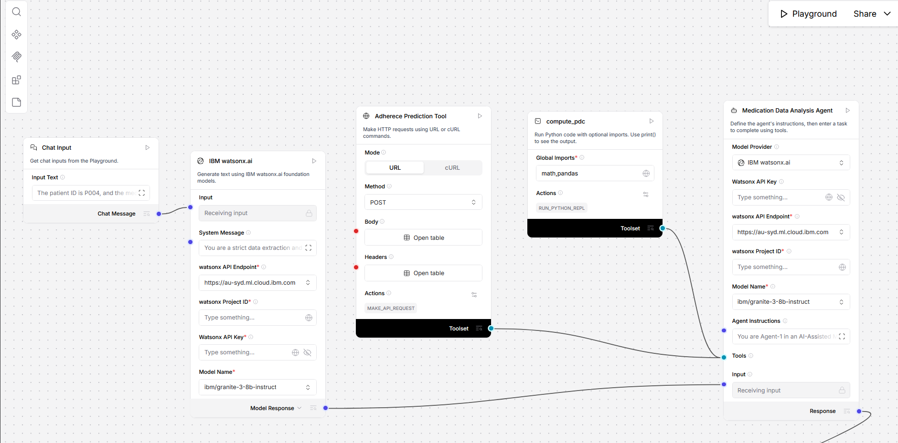
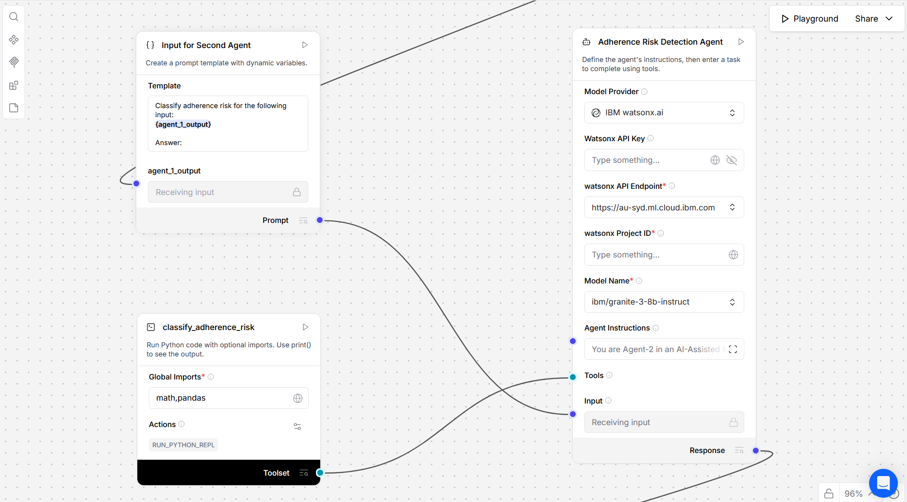
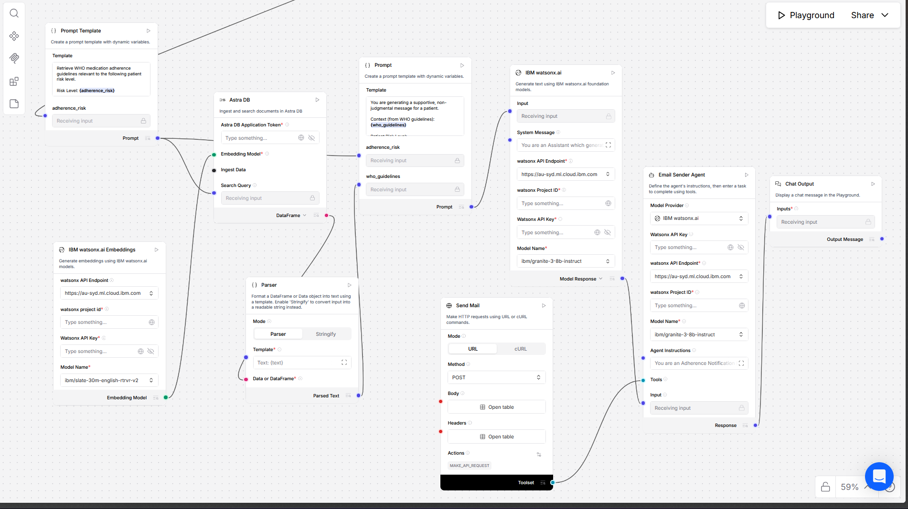

# 🩺 Medication Adherence Monitoring — Multi-Agent AI System

An explainable multi-agent AI system that detects early medication non-adherence and sends supportive, guideline-based reminders to patients.

Built using **LangFlow, IBM watsonx.ai, and RAG grounded in WHO/NICE guidelines**, this system is assistive, safe, and clinically aligned.

---

# 🚀 Overview

Medication non-adherence is a major issue in chronic care.  
This system proactively detects adherence decline and supports patients before missed doses become frequent.

✅ Early risk detection  
✅ Clinically grounded metrics  
✅ Guideline-based reminders  
✅ Assistive, non-diagnostic AI

---

# 🧠 System Workflow

## 🔄 End-to-End Flow

**Pipeline:**

Medication Data  
→ PDC Calculation  
→ Risk Detection  
→ WHO Guideline Retrieval (RAG)  
→ Patient-Friendly Message  
→ Email Notification

---

# 🤖 Agents in the System

## 1️⃣ Data Analysis Agent

- Processes medication logs
- Computes Proportion of Days Covered (PDC)
- Provides adherence metrics

---

## 2️⃣ Risk Detection Agent

- Detects adherence decline
- Classifies patient risk levels
- Enables early intervention

---

## 3️⃣ Guideline Retrieval Agent (RAG)

- Retrieves WHO/NICE adherence guidance
- Ensures medically grounded outputs
- Prevents hallucinations

---

## 4️⃣ Notification Agent

- Generates supportive messages
- Sends email reminders
- Encourages habit formation

---

# 📊 Clinical Validity

Adherence is measured using:

This ensures explainable and clinically accepted scoring.

---

# 🔐 Safety & Ethics

- Assistive-only AI (no diagnosis)
- Privacy-by-design
- Guideline-grounded outputs
- Hallucination-aware architecture

---

# 🛠 Tech Stack

- LangFlow (multi-agent orchestration)
- IBM watsonx.ai / Granite
- Python
- RAG with WHO/NICE data
- Email API integration

---

# 👥 Team

**Team Name:** Care3 AI

**Members:**

- Sandeepa N R
- Shrilaxmi Heralagi
- Tanish

We are passionate about building responsible AI solutions that create real healthcare impact.

---

# 🔮 Future Scope

- SMS / WhatsApp reminders
- Doctor dashboards
- EMR integration
- Adaptive nudging

---

⭐ Designed for responsible, real-world healthcare AI applications.
